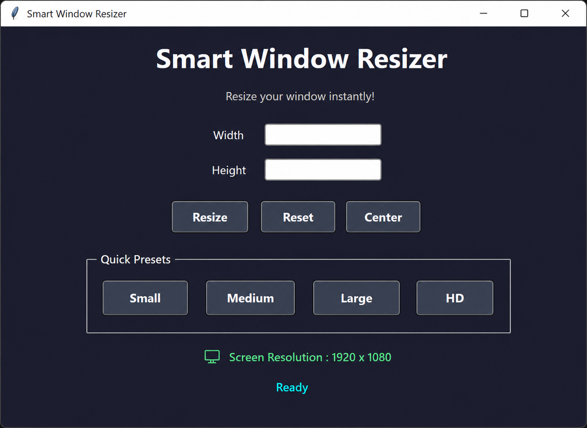

# Advanced Window Resizer

An interactive Python Tkinter application that allows users to resize the application window instantly using custom dimensions or preset sizes.

---

# 📸 Preview

```


---

# ✨ Features

- 🎨 Modern Dark Theme
- 📏 Resize Window Instantly
- 🎯 One-click Preset Sizes
- 📍 Center Window
- 🔄 Reset to Default
- 🖥 Display Screen Resolution
- ⌨ Press Enter to Resize
- ✅ Input Validation
- ❌ Error Popups
- 💬 Live Status Messages
- 🖱 Beginner-Friendly GUI

---

# 📦 Requirements

Python 3.x
Tkinter (Included with Python)

---

# ▶️ Run

```bash
python window_resizer.py
```

---

# 📂 Project Structure

```
Window-Resizer/
│
├── windows-resizer.py
├── windowresizer-adv.py
├── README.md
└── preview.png
```

---

# 🎮 How to Use

1. Enter Width.
2. Enter Height.
3. Click **Resize**.
4. Or select a preset size.
5. Press **Enter** for quick resizing.
6. Use **Center** to move the window to the center.
7. Use **Reset** to restore the default size.

---

# 🚀 Preset Sizes

| Preset | Resolution |
|---------|------------|
| Small | 400 × 300 |
| Medium | 800 × 600 |
| Large | 1200 × 800 |
| HD | 1366 × 768 |

---


#  Built With -

- Python
- Tkinter
- ttk Widgets

---

